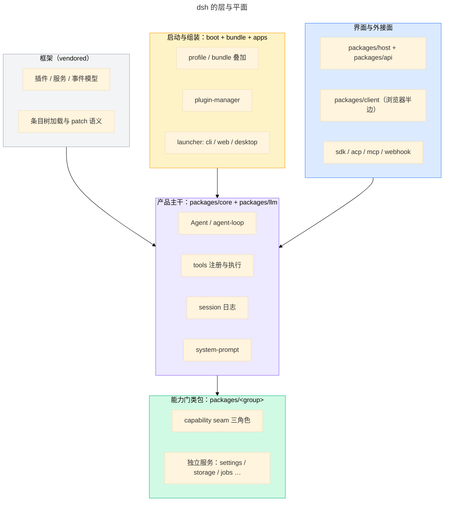

# dsh 架构：分层、平面与依赖方向

> 本文是 `references/dsh/index.md` 的子页。
>
> **范围**：dsh 的层、运行 / 编译平面与依赖方向——写插件前必须先装进脑子的那一层。
> 运行时机制见 `references/dsh/plugin-model.md`，可介入的扩展点见 `references/dsh/extension-points.md`，
> 不变式与设计准则见 `references/dsh/design-principles.md`。
> **事实 pin**：`deepseek-harness@dsh-v0.2.0-rc.2`。本页结构跨版本稳定：清单类内容不要往这里堆。
> 上游权威叙述：`docs/architecture.zh.md`；逐子系统：`docs/subsystems/`；包组与一行职责：`packages/README.md`。

## 1. 两个视图

- **运行时视图**：一次 `dsh --profile <name>` 启动就是**一棵插件树**。profile 与各层 bundle 依次叠加，
  每个条目都是插件，向共享 `Context` 贡献服务、类型化事件与可逆副作用。没有需要打补丁的特权内核：
  模型适配器、工具注册表、会话日志、agent loop 本身都是插件，都能从配置替换。
- **仓库视图**：实现这棵树的是 monorepo 的分层包结构（§2）。读源码、写插件、定位问题时，先分清自己在哪个视图。



## 2. 仓库分层

| 层               | 位置                                                                                                                                                                                                                                                                                                                                                                                                                                                                                    | 职责                                                                                                                   |
| ---------------- | --------------------------------------------------------------------------------------------------------------------------------------------------------------------------------------------------------------------------------------------------------------------------------------------------------------------------------------------------------------------------------------------------------------------------------------------------------------------------------------- | ---------------------------------------------------------------------------------------------------------------------- |
| 框架（vendored） | `vendor/cordis`、`vendor/loader`、`vendor/include`、`vendor/group`、`vendor/timer`、`vendor/hmr`                                                                                                                                                                                                                                                                                                                                                                                        | 插件 / 服务 / 事件模型、条目树加载、patch（include）语义、嵌套分组、随 disposal 回收的定时器、热替换                   |
| 产品主干         | `packages/core/agent`、`packages/core/agent-loop`、`packages/core/tools`、`packages/core/session`、`packages/core/system-prompt`、`packages/core/scope`、`packages/llm/llm`                                                                                                                                                                                                                                                                                                             | `Agent` 接口与默认驱动器、工具注册与执行流水线、仅追加会话日志、提示词与工具 schema 组装、作用域原语、消息与流式词汇表 |
| 能力门类包       | `packages/<group>`：`llm`、`subprocess`、`shell`、`fs`、`sandbox`、`ssh`、`terminal`、`ptc-runtime`、`skill`、`mcp`、`hooks`、`subagent`、`jobs`、`workflow`、`session`、`session-query`、`settings`、`credentials`、`storage`、`workspace`、`attachment`、`spill`、`lsp`、`web`、`computer-use`、`browser-use`、`deliverables`、`guard`、`todo`、`plan`、`goal`、`schedule`、`compaction`、`context`、`interaction`、`feedback`、`identity`、`telemetry`、`document`、`preset`、`util` | 每个 capability seam 的三角色（Service Definition / Provider / Consumer）与独立服务                                    |
| 传输与界面面     | `packages/api`、`packages/host`、`packages/client`、`packages/client/modules`、`packages/sdk`、`packages/acp`                                                                                                                                                                                                                                                                                                                                                                           | 远程 BFF 与 Typert RPC 网关、Web GUI host 服务、浏览器半边与客户端模块加载、进程外 SDK / ACP 协议                      |
| 启动与组装       | `packages/boot/app-boot`、`packages/boot/plugin-manager`、`packages/bundle/base`、`apps/cli`、`apps/web`、`apps/desktop`、`apps/desktop-host`                                                                                                                                                                                                                                                                                                                                           | profile 与 bundle 叠加、插件安装与 reconcile、共享第一层、可执行入口与桌面载体                                         |
| 自扩展与实验     | `packages/extensions/cordis-host-runner`                                                                                                                                                                                                                                                                                                                                                                                                                                                | 运行时动态 Cordis 插件的 Host 侧执行；其余的预稳定原型不在这里列举                                                     |

包名单与一行职责的权威是上游 `packages/README.md`；包之间的 peer 依赖图是 `docs/module-graph.zh.md`（本页不复制）。

## 3. 平面与边界

**编译面（compiler face）**：同一个包可以同时有 host 与 client 两半。拆分包用 `tsconfig.host.json` /
`tsconfig.client.json` 两个 leaf 配置，根 `tsconfig.json` 只是 solution；workspace `constraints` 门禁
按每个 project 自己的 face 检查引用（只有单一配置的目标可由任一 face 引用）。界面上的 host / client
边界因此是类型层面显式的事实，不是约定。

**运行平面**：

- **宿主进程**：`apps/cli` 的 launcher 起 profile，插件树在 Node 进程内运行；`ctx.subprocess` 与
  `ctx.sandbox` 之下是子进程与世界，`packages/ssh` 把同一套能力搬到远端。
- **Web 服务器**：`packages/api`（BFF 与 Typert RPC）与 `packages/host`（HTTP 路由、静态前端分发、
  目录选择、插件清单）。
- **浏览器**：`packages/client` 是 Web GUI 的浏览器半边；客户端插件以 bundle 形式下发，
  由 `packages/client/modules` 的模块系统按 boot graph 懒加载。
- **进程外协议**：`packages/sdk`（JSON-RPC）与 `packages/acp`（自动化用 ACP）在同一 launcher 之后
  提供非浏览器入口。

**源码面 vs 产物面**：静态门禁与测试把 workspace import 经 tsconfig `paths` 解析到 `src`，要求干净树上通过；
消费构建产物 `lib/` 的门禁必须显式声明这一点——两面不混用（`docs/development.zh.md`）。

**共享实例边界**：harness 包把 `@deepseek-ai/cordis` 声明为 peer 依赖，保证整棵树共享同一个 `Context` 实例；
包之间的 peer 边才表示「消费端必须提供这个共享实例」。vendor 包以 `@deepseek-ai/` 重新发布
（`docs/rescope.zh.md`），所以 import 写 `@deepseek-ai/cordis` 而不是 `cordis`。

## 4. 组装：profile、bundle 与 patch

- **profile** 是 Harness home 里的具名组装：列出自己叠加的 bundle、存放树外插件、保存自己的 patch。
- **bundle** 是「配置项 + 挂载代码」的分发格式，因此它插入的内容总能被其上各层 patch。
- 两者都在 `package.json` 的 `dsh` 字段里声明：`dsh.profile` 列 bundle，`dsh.bundle` 指向 patch 文件。
- **层序**：按 profile 顺序叠加各 bundle → profile 自己的 patch → home 级 patch → `--patch` overlay。
  一条 patch 按 id 定位条目并替换其整个 config，或插入新条目。
- **共享第一层**：`packages/bundle/base` 提供模型适配器、工具、持久化、沙箱与审批策略、设置、凭据、遥测，
  也就是 `web` / `headless` / `sdk` / `acp` 的共同底座；`dsh-sdk-minimal` 是刻意不套用它的例外。

仓外插件的挂载字段、失败串与层序细节见 `references/develop/mounting-and-manifest.md`；
启动链路本身（loader / plugin-manager / 客户端装载）见组装与启动分册（plan #14）。

## 5. 客户端面

- `packages/client/web` 是浏览器侧的 boot kernel：两段式启动客户端插件树、无框架的启动页、共享模块表。
- `packages/client/modules` 由宿主侧组装 boot graph 并下发插件 bundle，浏览器再懒加载。
- 客户端 shell 在启动后校验各 entry 是否激活；有未激活项就停在启动页并给出计数——**启动时能开 ≠ 运行期正常**。
- 客户端插件的构建面（未发布的 `clientBundle` preset）不在 0.1.0 的承诺范围内；取证与定位走
  `references/dogfood/index.md`。

## 6. 主干：一次输入怎么走

一个**步骤**（step）= 一次模型请求加上它调用的工具；一个**轮次**（turn）含 0..n 个步骤，
从领取首条输入开始，到不再欠任何工作时关闭。

```text
turn/start
  领取首条输入 + 一条排队消息；组装提示词片段与工具 schema
  -> agent/pre-step            waterfall：改写或拒绝领取
     step/start
     agent/request             waterfall：解析路由与能力
     提交 system/message 与 user/message；从日志派生并冻结模型历史
     llm/stream                waterfall：流式请求
       agent/assistant-stream  start / chunk* / end（进程本地实时事件）
     tool/call* -> tools/pre-execute -> tools/execute -> tools/post-execute -> tool/result*
     step/end
     还有欠账或新输入 ⇒ 下一步骤
  -> agent/turn-stopping       serial：没有 next()
turn/end
```

- `turn/*`、`step/*`、`system/message`、`user/message`、`assistant/message`、`tool/*` 是**持久会话事件**；
  `agent/*`、`llm/*`、`agent/assistant-stream` 是**实时扩展点**。事件域怎么选见 `references/dsh/extension-points.md`。
- **会话日志是模型所见上下文的唯一来源**：`deriveMessages()` 从日志投影模型历史；「模型可见即已记录」
  是运行时不变式——想给模型新的可见输入，就得新增会话事件（细节见 `references/dsh/design-principles.md`）。
- 时序与流水线细节：`docs/agent-lifecycle.zh.md`、`docs/tool-execution-pipeline.zh.md`；事件生产方 / 消费方：
  `docs/event-producer-consumer.zh.md`。

## 7. 依赖方向与门禁

- 跨包一律用**包名**，不 import 别的包的内部路径；包内相对 import 带 `.ts`。需要别人的能力时找它的服务或事件，
  而不是它的文件。
- workspace 依赖范围有约定：DSH 包之间用 `workspace:*`，vendor / native 用 `workspace:~`。
- 注册类贡献必须可回收：新行为挂在文档化的扩展点上，不改核心。
- 与此相关的门禁：`verify-cordis-config`（配置里引用的包必须在该 resolver manifest 的 dependencies 里）、
  workspace `constraints`（按 compiler face 校验引用）、`hygiene`（workspace / package / 依赖检查）。

## 8. 新行为该放哪

先决定**事件域**（session / agent / capability），再决定**归属的插件或服务**，最后证明它可回收；
判定表见 `references/dsh/extension-points.md`，不变式见 `references/dsh/design-principles.md`。

## 9. 源码最后手段

本页与 `references/dsh/` 其它页覆盖不到的细节，才去读上游源码：

- 只看一条事实：`git -C 3rdp/deepseek-harness show deepseek-harness@dsh-v0.2.0-rc.2:<path>`（只读，不切换工作树）。
- 本页引用的每条上游路径都在 `src/facts.test.ts` 有台账条目；失效时测试按条目报出来。
