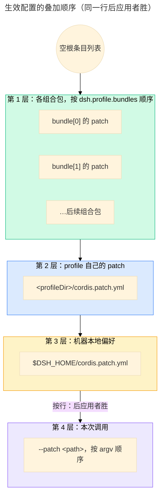

# 组装与启动链路：从 profile 到插件树

> 本文是 `references/dsh/index.md` 的子页。
>
> **范围**：一次 `dsh --profile <name>` 启动怎么把 profile、组合包与 patch 叠成一棵插件树，以及它怎么被装载、激活与判定失败。
> 运行期怎么改这棵树（安装 / 启停 / reconcile / HMR）见 `references/dsh/plugin-management.md`；
> 浏览器那一半见 `references/dsh/client-loading.md`；清单字段与 patch 写法见 `references/develop/mounting-and-manifest.md`。
> **事实 pin**：`deepseek-harness@dsh-v0.2.0-rc.2`。本页写链路与判定，不堆字段清单。
> 上游权威：`apps/cli/reference/README.zh.md`（层序与 profile 语义）、`packages/boot/app-boot/README.zh.md`（启动策略）、
> `docs/subsystems/boot.zh.md`（profile 管理的类型与服务）、`docs/architecture.zh.md`（组合概览）。

## 1. 谁负责哪一段

| 角色             | 位置                                                | 负责                                                                              |
| ---------------- | --------------------------------------------------- | --------------------------------------------------------------------------------- |
| launcher         | `apps/cli`                                          | 解析启动器 flag、选 profile、初始化模板、把 runtime resolution 装进 Node resolver |
| profile          | `$DSH_HOME/profiles/<name>`                         | 具名组装：`dsh.profile.bundles` 列表、自己的 patch 文件、树外插件依赖             |
| 组合包（bundle） | `packages/bundle/base`、`packages/bundle/web-app` … | 「配置项 + 挂载代码」的分发格式，`dsh.bundle.patch` 指向 patch 文件               |
| loader           | `vendor/loader`、`vendor/include`、`vendor/group`   | 把各层 patch 落到条目树上，解析并装载插件模块                                     |
| 启动与激活审计   | `packages/boot/app-boot`                            | 加载环境层、组合 profile、启动插件、按 required 策略判定成功或拆卸                |
| 运行期管理       | `packages/boot/plugin-manager`                      | 安装 / 删除 / 启停 / 选择组合包，并把结果写回 profile                             |
| 配置热重载       | `packages/boot/hmr`、`vendor/hmr`                   | 监视 manifest 与用户 patch，串行化重载（未启用时改动需要重启）                    |

## 2. 层序：生效配置怎么叠出来

**入口**：`dsh <name>` 是 `dsh --profile <name>` 的简写；`plugin` 是管理命令，因此启动同名 profile 要写
`dsh --profile plugin`。启动器 flag 必须写在最前面，遇到第一个无法识别的 token 之后的内容交给应用
（`ctx.cmdlineArgs`，见 `packages/boot/cmdline`）。

**随附模板**（首次使用自动初始化）：`web` = base + web-app（应用层 patch **实时**重载）、
`headless` = base + headless、`sdk` = base + sdk-app、`acp` = base + acp-app（都只在启动时应用 patch）、
`sdk-minimal` = 独立组合包（刻意不套 base）。`dsh --profile <name> --from-default-profile <template>`
会在启动前用某个模板初始化一个新的自定义 profile（目标名不能是随附名、目录必须不存在）。
组合包名先从 dsh **安装目录**解析、再从 profile 目录解析，所以内置组合包永远来自当前运行的 `dsh`，
树外组合包来自 profile 里由 pnpm 管理的 `node_modules`。

**层序**：生效条目列表以**空根**为起点，按下列顺序叠加，**同一行后应用者胜**：

- 组合包**不是**配置行：它的 patch 层插入的行才在树里；一个包可以声明多个 patch 文件，它们按数组顺序
  拼成**同一层**。
- `dsh.bundle.patch` 的类型是 `string | string[]`（`packages/util/package-manifest/src/types.ts`）。
- 层内的行级语义——按 id 定位、替换**整个** config 而不是深合并、`insert:` 追加、同 id 跨层静默复用/替换、
  各类警告串——全部在 `references/develop/mounting-and-manifest.md`；本页不重复。
- 环境层（`.env`）先于配置层：调用目录的文件优先于 harness home 的文件，两者都低于继承环境；
  `PATH`、`DSH_*`、`XDG_*` 这类进程启动变量必须用环境变量给，文件里设置会被拒绝。

## 3. 装载：条目树与模块解析

- launcher 在挂载 profile 条目前，从**安装依赖图 + 有序 bundle 依赖图**算出一份不可变的
  **runtime resolution**，并把它安装到 Node 的 ESM 与 CommonJS 解析器上——不创建 fallback 链接，
  profile 自己安装的包保留原生优先级。
- loader 把各层 patch 应用到条目树：patch 按 id 定位已有行；带 `insert:` 的行被追加（patch 自己带 `id`
  且命中一个 group 时推进该 group 的 `config`）；缺 id 的 insert 行也能进入树。
- `cordis:include` 与 `cordis:group` 注册为 Loader 的 **builtin**：group 行可以把一个提供方与它的消费方
  放进同一个 `isolate` realm（agent preset 依赖这一点）。
- patch 里 `insert` 的插件名可以是绝对路径、file URL 或包标识符；加载时**绝对路径**与**相对 patch 文件**
  的 `./` / `../` 路径会转成 file URL，而用于断言已有条目名的 `name` 与替换用的 `config` 保持原样。
- `--dump-config` 的 patch 未命中目标只报警告并跳过；**空文件或只有注释的 patch 会让启动失败**
  （要禁用该层写作 `[]`）。

## 4. 激活：required 策略与失败面

loader 结算后，app-boot 做一次**启动审计**：

- 只 **optional** 条目未激活 → 警告后继续（保留能跑的插件）。
- 已启用的 **required** 条目失败 → `boot()` 释放已挂载插件并以非零码退出，CLI 只输出一次启动诊断。
- required 列表覆盖共享 Agent 执行、应用 endpoint 与 Web 启动/传输：`agent-loop`、`webserver`、`modules`、
  `connection`、`headless-runner`、`acp`、`sdk-jsonrpc-server`；profile 里不存在的 required id 与显式
  `disabled` 的 required 条目不参与审计。

失败面（启动期 / 后续配置 HMR）：

| 失败模式                                      | optional 条目启动时  | required 条目启动时  | 后续配置 HMR                             |
| --------------------------------------------- | -------------------- | -------------------- | ---------------------------------------- |
| 根配置或必需 overlay 缺失 / 不可读 / 非法     | 终止启动             | 终止启动             | 拒绝该次 patch，运行中的配置不变         |
| 模块 import 失败或求值抛出                    | 警告；继续           | 终止启动             | 报告错误，保留成功兄弟；修正后可激活     |
| Config schema 校验失败                        | 警告；继续           | 终止启动             | 新条目保持未激活，现有条目保留实例与配置 |
| `!!js` 求值失败（config 或 `disabled`）       | 警告；继续           | 终止启动             | 报告错误，不把条目当作已禁用             |
| `apply()` 抛错（同步或结算后的异步）          | 警告；继续           | 终止启动             | 报告错误，保留成功兄弟                   |
| 注入的服务不可用                              | 警告；等待依赖       | 终止启动             | 条目继续等待；补上提供方即可激活         |
| 未处理 rejection（脱离 `apply()` 的异步任务） | 致命：释放并非零退出 | 致命：释放并非零退出 | 致命：释放并非零退出（与条目 id 无关）   |

完整矩阵与逐条证据见 `packages/boot/app-boot/README.zh.md`。

**组合包被跳过不是启动失败**：组合包无法解析、manifest 读不了、patch 加载失败，或它自己声明的 DSH peer
与运行时版本不兼容时，该组合包被跳过并计入 `skippedBundles`，启动器每次启动报告一次；其余组合包保持
原顺序。profile 自己的 patch 与 manifest 错误仍然终止启动（`references/dsh/plugin-management.md` §5 讲豁免）。

## 5. 预览与诊断：三种 dump

| 命令                                      | 内容                                                                                   |
| ----------------------------------------- | -------------------------------------------------------------------------------------- |
| `dsh --profile 
 --dump-default-config` | 只打印组合包各层                                                                       |
| `dsh --profile 
 --dump-config`         | 加上 profile 的 `cordis.patch.yml`、home 级 patch 与 `--patch` overlay                 |
| `dsh --profile 
 --dump-config-schema`  | 组合成功后输出 JSON Schema 2020-12；会**导入**插件模块读 schema，只对可信 profile 运行 |

三者都会打印注释标明每行来自哪个文件、被哪些 overlay 改过，`!!js` 保持未求值，未命中目标的 patch 报到
stderr；dump 会初始化缺失的 profile 文件，但**不跑**应用的参数提供方，因此展示的是解析应用参数之前的树。
配置重载的结果也可由服务观察：成功重载后发 `app-boot/config-reload`（不带 diff，监听方自己重读 Loader）。

## 6. 重载边界

启用的 `dsh-hmr` 监视 profile manifest 与两份用户 patch（profile 级与 home 级），按事务方式重新组合并应用；
HMR 被禁用或不存在的模板，配置改动需要重启进程。重载失败的处理见 §4 右列；它不会重跑 required 启动审计，
也不会整体回滚。运行期安装/启停走到同一套重载路径的细节见 `references/dsh/plugin-management.md`。

## 7. 源码最后手段

本页与上游 README 覆盖不到的细节才读源码：

- 只看一条事实：`git -C 3rdp/deepseek-harness show deepseek-harness@dsh-v0.2.0-rc.2:<path>`（只读，不切换工作树）。
- 本页引用的每条上游路径都在 `src/facts.test.ts` 有台账条目。
