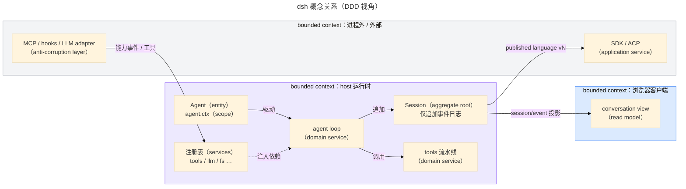

# 概念模型：用 DDD 读 dsh

> 本文是 `references/dsh/index.md` 的子页。
>
> **范围**：把 dsh 的领域概念按 DDD 的词汇归类，并给出它们之间的关系与一次真实走查。
> 层与平面见 `references/dsh/architecture.md`，运行时机制见 `references/dsh/plugin-model.md`。
> **事实 pin**：`deepseek-harness@dsh-v0.2.0-rc.2`。
> **语言约定**：本文是全手册**唯一**给出中英对照的地方——正文用中文，概念术语一律用英文原词，
> 对照关系只维护在 §2 的表里；其它页面只用英文术语。
> 上游权威：`docs/glossary.zh.md`（领域词汇）、`docs/i18n/terminology.md`（译法表）。

## 1. 为什么用 DDD 读 dsh

dsh 不是 DDD 框架，但它的构造方式与 DDD 的关注点高度重合：有明确的边界（进程与 compiler face）、
有一致性边界（会话日志）、有领域事件（会话事件）、有可替换能力（capability seam）。
借 DDD 的词汇能回答「这段代码属于哪个概念、该改谁」，也能避免把不同层次的东西混成一锅。

**读法**：先用它定位概念类别（§2），再看关系（§3），最后跟着一次输入走一遍（§4）。
不要把 DDD 当规范——§5 列了 dsh 有而 DDD 没有对应词的概念。

## 2. 术语对照表

| English（主）                 | 中文        | dsh 对应物                                                                                                                            |
| ----------------------------- | ----------- | ------------------------------------------------------------------------------------------------------------------------------------- |
| bounded context               | 界限上下文  | host 运行时 / 浏览器客户端运行时 / SDK 进程 / 桌面载体；边界由进程、wire 与 compiler face 固定（`references/dsh/architecture.md` §3） |
| ubiquitous language           | 通用语言    | `docs/glossary.zh.md` 与 `docs/i18n/terminology.md` 的术语集；本手册只索引、不改写                                                    |
| aggregate (root)              | 聚合（根）  | **Session 日志**（一致性边界：只能追加）；`AgentHandle`（活跃工作的所有者）                                                           |
| entity                        | 实体        | `Session`、`Agent`、`Attachment`、`Job`、`Workspace`                                                                                  |
| value object                  | 值对象      | `Message`、`SessionEvent` 载荷、`ToolResult`、branded id、`Config` 取值                                                               |
| domain event                  | 领域事件    | `SessionEventMap` 里的持久事件（可回放）；`agent/*` 是进程内实时信号，**不是**持久事实                                                |
| integration / published event | 集成事件    | 跨上下文的那部分：`session/event` 广播、SDK / ACP / webhook 的对外载荷                                                                |
| repository                    | 仓储        | `SessionPersistence` seam、storage hub（按 id 取 / 存聚合）                                                                           |
| domain service                | 领域服务    | 工具执行流水线、agent loop、system-prompt 组装、compaction                                                                            |
| policy / specification        | 策略 / 规约 | guard、sandbox 策略、approval、permission preset、`tools.restrict`                                                                    |
| anti-corruption layer         | 防腐层      | LLM adapter、MCP client、hooks bridge、SDK / ACP gateway、Typert remote                                                               |
| application service           | 应用服务    | `ctx.commands` 的处理器、boot 与 profile 组装、plugin-manager                                                                         |
| published language            | 发布语言    | 会话格式 `vN`、tool schema、wire protocol、Typert remote 声明                                                                         |
| module                        | 模块        | package group 与服务所有权：一个包管一个关注点，边界靠 seam 而不是 import                                                             |

**dsh 有而 DDD 没有直接对应词的概念**（属于本手册自己的分类，不硬塞进上表）：

- **capability seam**：含 Service Definition / Provider / Consumer 三角色的完整可替换能力（见
  `references/dsh/extension-points.md`）。
- **scope / shadowing**：注册的可见性单位（全局或恰好一个 scope key），最具体者胜出。
- **projection**：CQRS 意义的读模型（`ctx.sessionProjections`），从已提交事件折叠出类型化状态。
- **profile / bundle**：组装与分发单位，不是代码模块。
- **effect / fiber**：注册的生命周期单位，卸载即撤销。

## 3. 概念关系

读图要点：

- 事件从聚合根向外流（严格单向），客户端与进程外上下文都**只读**日志；
- 外部能力经防腐层进入注册表，**不直接改聚合**；
- 策略与规约挂在事件或 seam 上（`references/dsh/extension-points.md`），不属于任何单个实体。

## 4. 走查：一次输入落到哪些概念

1. 用户输入成为**持久领域事件** `user/message`，进入 `Session` 聚合（会话日志，`packages/core/session`）。
2. `Agent` 被驱动，`agent/pre-step` / `agent/request` 是**进程内**实时信号，用来改路由或拒绝领取。
3. `agent loop` 作为**领域服务**从日志投影模型历史（`deriveMessages()`），经**防腐层**（LLM adapter）发起流式请求。
4. 模型要调用能力时，经 `tools` 流水线（**领域服务**）走**能力 seam**（Consumer → Provider）。
5. `assistant/message` 与 `tool/result` 作为**领域事件**落回日志；日志是唯一真源。
6. 浏览器客户端作为另一个**界限上下文**，从事件**投影**出 read model 并渲染——它不拥有领域状态。

## 5. 反例：不要把 DDD 硬套

- **`ctx.<key>` 不等于 universally 的 "domain service"**：它可能是 capability seam（能力）、组合点或独立服务；
  分类看 `docs/capability-seams.zh.md`。
- **不要引入通用 repository 泛型层**：dsh 的仓储本身就是 seam，实现（JSONL / SQLite / 远端）可换；
  包一层泛型只会挡掉它的换实现能力。
- **event sourcing ≠ dsh**：dsh 是「追加日志 + 投影」，格式有 `SESSION_FORMAT_VERSION` 与相邻迁移链这套自己的机制
  （`docs/session-format-status.zh.md`）。
- **不要用 DDD 的 aggregate 边界去切代码包**：代码边界是 package group 与服务所有权，两者相关但不等同。

## 6. 源码最后手段

- 定义出处：`docs/glossary.zh.md`；译法（中英对应）出处：`docs/i18n/terminology.md`。
- 只看一条事实：`git -C 3rdp/deepseek-harness show deepseek-harness@dsh-v0.2.0-rc.2:<path>`（只读，不切换工作树）。
- 本页引用的每条上游路径都在 `src/facts.test.ts` 有台账条目。
