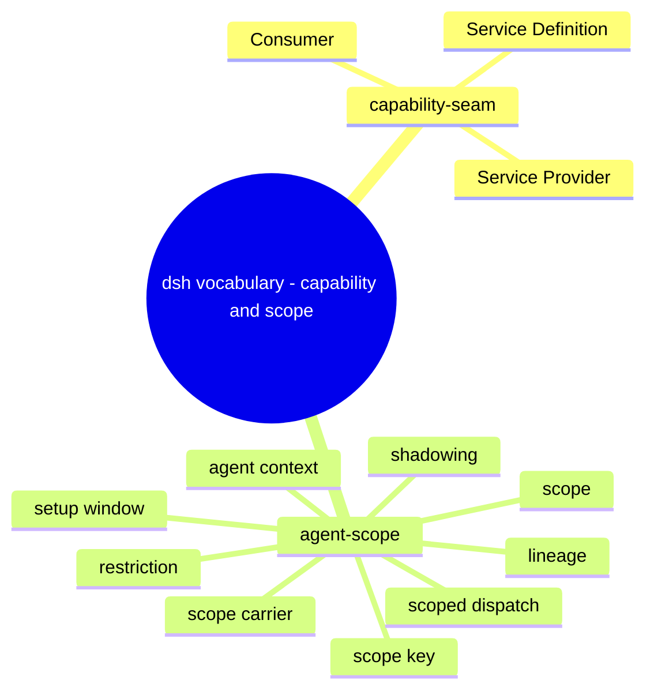
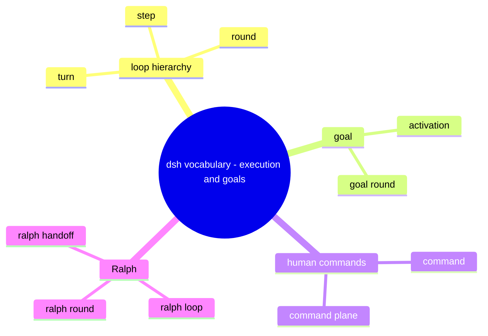

# 领域词汇：官方术语索引与关系

> 本文是 `references/dsh/index.md` 的子页。
>
> **范围**：官方术语的**权威在哪**、按域怎么分组、它们之间是什么关系——本页只做索引与路由，不复制定义。
> DDD 归类与中英对照见 `references/dsh/concept-model.md`。
> **事实 pin**：`deepseek-harness@dsh-v0.2.0-rc.2`。
> **语言约定**：本页只用英文术语；中文对应在 `references/dsh/concept-model.md`。
> 上游权威：`docs/glossary.zh.md`（定义）、`docs/i18n/terminology.md`（译法）。

## 1. 权威在哪

| 问题                                 | 去哪                                                          |
| ------------------------------------ | ------------------------------------------------------------- |
| 这个词在这里**是什么意思**           | `docs/glossary.zh.md`：每个概念一条规范定义，带 Markdown 锚点 |
| 这个词**中文怎么写**、官方怎么译     | `docs/i18n/terminology.md`：中英译法表                        |
| 某个类型 / 服务 / 事件的**完整字段** | `docs/subsystems/`：一包一页的类型与接线参考                  |
| 这段行为**属于哪一层**               | `docs/architecture.zh.md`：组合、核心包、事件、轮次流程       |

本手册只在这里登记「哪个术语属于哪个域、该读哪一页」，定义永远以上游为准——上游改了定义，这里不用改。

## 2. 术语域

**图 1：capability 与 scope（能力怎么被替换对注册对谁可见）**

**图 2：运行层级、目标与命令（一次运行在哪一层计数、谁能续跑）**

各域要回答的问题：

| 域                | 回答                                                                                                 | 什么时候读                    |
| ----------------- | ---------------------------------------------------------------------------------------------------- | ----------------------------- |
| `capability-seam` | 什么叫「一个能力」：Service Definition / Provider / Consumer 三角色，以及它不是什么                  | 设计或替换一项能力时          |
| `agent-scope`     | 注册的可见性与生命周期：global vs scoped、`agent.ctx`、shadowing、restriction、setup window、lineage | 要让行为只对某个 agent 生效时 |
| `loop hierarchy`  | turn / step / round 的层级与计数归属                                                                 | 分析一次运行或写拦截逻辑时    |
| `goal`            | 同会话持久完成目标的生命周期与 Goal Round 上限                                                       | 做续跑、目标管理或相关工具时  |
| `human commands`  | 斜杠命令、命令平面与「命令不等于工具」的区别                                                         | 加一个面向人的入口时          |
| `Ralph`           | 全新 agent 的前台循环、Round 与 handoff 的边界                                                       | 做长任务的策略编排时          |

## 3. 术语之间的关系

- **`capability-seam` 是 `agent-scope` 之外的另一条轴**：seam 管「能力怎么被替换」，scope 管「注册对谁可见」。
  一个 seam 的 Consumer 完全可以注册在某个 scope 内。
- **`loop hierarchy` 是容器关系**：turn 含 step；round 是外层策略迭代（Goal Round、Ralph Round）的计数单位，
  **不等于** turn——普通人类轮次不消耗 Goal Round 上限。
- **`goal` 与 `Ralph` 是两种不同的续跑策略**：goal 附着在现有会话（会话日志仍是它状态的真源）；
  Ralph 每 Round 用全新子会话 + 有界 handoff，两者都不改变 `loop hierarchy` 的定义。
- **`human commands` 与模型工具是两条入口**：命令由人类适配器解释、不成为模型消息；工具才是模型可见的输入。

## 4. 怎么用

1. 先在本页定位术语属于哪个域，再读 `docs/glossary.zh.md` 的该条目（有锚点，可直接跳）。
2. 需要类型 / 服务 / 事件的字段级细节时，转 `docs/subsystems/`。
3. 需要在代码里落地时，回到 `references/dsh/extension-points.md` 选接缝、`references/dsh/design-principles.md` 核对不变式。
4. 术语的**中文对应**只在 `references/dsh/concept-model.md` 查——本页与其它页不重复。

## 5. 源码最后手段

- 定义冲突时以源码为准：`git -C 3rdp/deepseek-harness show deepseek-harness@dsh-v0.2.0-rc.2:<path>`（只读，不切换工作树）。
- 本页引用的每条上游路径都在 `src/facts.test.ts` 有台账条目。
