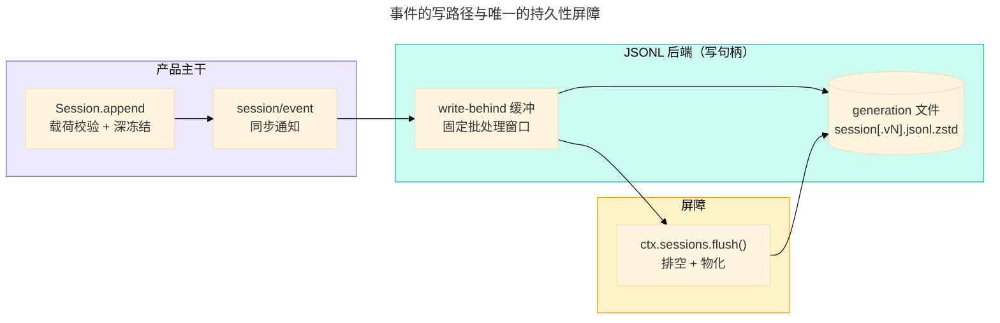

# 持久化、崩溃恢复与格式版本：日志怎么活过重启

> 本文是 `references/dsh/index.md` 的子页。
>
> **范围**：仅追加日志怎么落盘、`flush` 屏障在哪里、崩溃后谁来补轮次边界、格式版本与相邻迁移链怎么保鲜。
> 日志本身（事件词汇、surface、派生历史）见 `references/dsh/session-log.md`；启动链路见 `references/dsh/composition-and-boot.md`。
> **事实 pin**：`deepseek-harness@dsh-v0.2.0-rc.2`。本页写机制与契约；版本号与语义的权威是
> `docs/session-format-status.zh.md`，本页只讲怎么读、怎么坏、升级要动什么。
> 上游权威：`docs/subsystems/persistence.zh.md`、`docs/session-format-status.zh.md`、
> `docs/persistence-changes/README.zh.md`、`docs/cookbook/adding-a-session-format-version.zh.md`、`packages/session/README.zh.md`。

## 1. seam 与句柄：唯一入口

持久化是一个 capability seam：Service Definition 是 `ctx.sessionPersistence`（`packages/session/session-persistence`），
随产品交付的 provider 是 JSONL 后端（`packages/session/session-persistence-jsonl`）。**它不引入平行的持久化事件类型**，
仍然只在 `SessionEvent` 上工作。

| 层   | 方法                                                                            | 要点                                                                           |
| ---- | ------------------------------------------------------------------------------- | ------------------------------------------------------------------------------ |
| 服务 | `create(header, opts)` / `open(id, access)` / `stat(id)` / `list()` / `flush()` | `create` 取写所有权；`open(id,'write')` 原子抢占单写者；`stat` 返回 `revision` |
| 句柄 | `read(offset?, length?)` / `append(events)` / `flush()` / `close()`             | 逐会话单写者；**日志读写一律经句柄**，没有按 id 寻址的读写                     |

- **所有权**：进程内已有活跃写持有者时，第二次 `open(id, 'write')` 以 `SessionAlreadyOwnedError` 拒绝；对 read 句柄写入
  以 `SessionReadOnlyError` 拒绝；句柄关闭后一切操作以 `SessionHandleClosedError` 拒绝。跨进程租约层预留了
  `SessionOwnershipLostError`（当前随产品交付的进程内后端还不会抛它）。
- **`identity` 与 `stat().revision` 只在「同一服务实例 + 同一 session」内可比**：`revision` 相等表示日志未变，
  不相等不承诺任何事，写所有权易主也不改变它；它不参与 `open` / `read` / resume。
- **`SessionHeader` 与 `inheritedEventCount` 并排存储**：前者是存储元数据，后者是 fork 继承前缀的**逻辑事件数**
  （不是字节数、不是行数）；`header.isSeeded` 为真时 `create` 必须给出它，不匹配直接拒绝。
- **没有删除 API**：日志在 `root` 下累积，只能由外部清理。

## 2. 可见性、`append` 与唯一屏障 `flush`

- **`create` 一返回，本进程内即可被 `open` / `stat` / `list` 观察到**；物理物化可以推迟到第一次 `append` / `flush`。
  **其他进程只看得见已物化的会话**——崩溃前从未物化的会话等于从未存在。
- **`append` 只是 best-effort**：解析（resolve）只承诺「已接受、已排序、本实例后续读取可见」，可能仍是缓冲。
- **`flush` 是唯一的持久性屏障**：解析后已确认的 append 全部落盘，且会话对其他进程物化可见。
  - 逐会话：`ctx.sessions.flush(session)` —— **这是唯一被认可的调用形式**（store 持有 scoped `session/flush` 载体）；
    直接 `ctx.parallel('session/flush', …)` 会破坏「一个所有者一种写法」。
  - 服务级：`ctx.sessionPersistence.flush()` 排空并物化所有活跃写句柄，失败聚合成一个 `AggregateError`，
    其余句柄继续排空。
- **`session/event` 是同步 fire-and-forget 通知**：后端把它路由进该会话写句柄的有界 write-behind 窗口，
  生产方（agent loop）不因 I/O 阻塞。窗口只在有意的批量等待上设界，不限制事件循环调度或后端完成延迟。
- **checkpoint policy**（`packages/session/session-checkpoint-policy`）在三个位置插入屏障，且失败 fail-closed
  （适配器与工具体根本不会执行）：`llm/stream` 首个 chunk 之前、**顶层** `tools/execute` 之前、每个 `agent/pre-step`。

## 3. JSONL 后端：磁盘上是什么

- **Config 只有两项**：`root`（必填，无默认——`process.cwd()` 默认会把会话散到各处）与 `compression`（默认 `zstd`，
  可选 `none`）。**一个 root 只属于一种物理编码**，混放两种后缀会在发现/查找时被拒绝。
- **布局**：`<root>/<projectKey(cwd)>/<escaped-id>/session[.vN].jsonl[.zstd]`。`projectKey` 是刻意有损、给人看的
  （分隔符归一、251 字符截断），`cwd` 缺失时为 `_no-cwd`；session id 是不可信的品牌字符串，**必须经注入式转义**
  再进路径（不许手拼 session 路径）。
- **物理头行**携带 `version` / `id` / `createdAt` / `isSeeded` 等存储字段；**精确的继承前缀不在这里**，
  它在带 `inherited: true` 的 `session/end-seed` 事件上。
- **`stat` / `list` 只读最高 generation 的头行**：从不读事件行、从不启动迁移。历史（`version < 当前`）revision 还
  会折入整个 root 的 corpus 指纹。
- **无删除 API；压缩后的日志不可按行阅读**——取证要先解压或用句柄读。

## 4. 崩溃恢复：谁补边界

- **持久化不修复开放轮次**：一个轮次中途崩溃的日志以打开的 `turn/start` 结尾。后端只丢弃撕裂的物理尾部
  （属于一次未完成 append 的不完整碎片），在写句柄首次新 append 前持久重写其余完整记录并记一条 warn。
- **修复是读方的职责**：resume（agent loop）先 `open(id, 'write')`（借此排除并发 resume），冷读全量日志，
  计算 `interruptedTurnClosers()`——缺失的工具错误结果、未闭合的 `step/end`，以及合成的
  `turn/end { reason: { kind: 'interrupted' } }`——然后作为普通批次经同一句柄追加，再交给 `ctx.sessions.prepare`。
- **只读观察方不回写**：session-query 的冷读在内存里配平同一组 closers，磁盘不动；崩溃前已持久追加的事件全部保留。
- **`interrupted` 是唯一一个 loop 不会实时发出的 `TurnEndReason`**；fork 种子走 `forked`（见
  `references/dsh/session-log.md` §7）。
- **后台写失败**：按序保留对应事件、暂停自动路径、经 logger 报告；下一次显式 flush 重试并向调用方响亮拒绝。

## 5. 格式版本：三个记录，互不推导

| 记录       | 位置                                                    | 含义                                                      |
| ---------- | ------------------------------------------------------- | --------------------------------------------------------- |
| 写入器版本 | `SESSION_FORMAT_VERSION`（`packages/core/session`）     | 代码里唯一手工维护的当前写入格式；只在**结构**变化时递增  |
| 定稿基线   | `docs/persistence-changes/finalized/v4.json` + 定稿记录 | 已接受的兼容性基线；可加 `same-version` 记录，不改变语义  |
| 已发布记录 | `docs/session-format-status.zh.md` 的 `latestReleased…` | 已发布产品里确实携带的格式，附 `evidenceTag` 指回发布标签 |

- **三者互不推导**：包版本、codec 导出名、fixture 文件名、projection cache 版本都**不是**格式版本权威；也不存在
  「released 布尔值」，靠比较写入器常量与发布记录判断。alpha / beta / RC 发布同样确立持久化数据义务。
- **什么算结构性变化**：header 形状、事件信封、核心事件语义、surface 重建机制。**普通新增事件类型不算**——
  它由 `ignorable` 与 required-on-read 规则覆盖（见 `references/dsh/session-log.md` §3）。
- **向后兼容可以留在当前版本**：用一条新的 acknowledged 记录（`same-version`）承认即可；破坏性差异需要更高的写入器
  版本与它自己的头版本转换，**不能复用已接受的转换**，也不能改写已接受的机器记录。

## 6. 相邻迁移链：不可变 generation

- 迁移以**相邻**包发布、一版一包：`session-format-v0-to-v1`（共享布局）、`v1-to-v2`（折叠 `assistant/chunk` 进
  `assistant/message`、补 `assistant/attempt`、重排 seq）、`v2-to-v3`（系统提示词成为 surface 节点、规范信封）、
  `v3-to-v4`（tool 结果提升为一等 tool-role 消息、消息来源改名、交付校验）。
- **已提交的 generation 绝不重命名、覆盖或删除**：历史读由后端 `open` 顺手迁移（读句柄返回迁移后的值，**不发布**），
  写句柄则在其旁边发布唯一的当前 successor，源文件字节不变；**绝不因选中的 generation 高于当前版本或非法而回退到前驱**。
- **codec 复用**：每个边包在自己的 manifest 里声明 `dsh.sessionFormatMigration`（`from` / `to` / 导出名），
  并**直接复用上一包导出的 source codec**（依赖它，不复制、不重定义）。
- **目录是 build-static**：`session-format-catalog` 在模块初始化时校验 0..当前版本「每版恰好一个 codec、相邻边不缺不重」；
  profile 不能增删或重排迁移边——**插件挂载不允许决定历史数据能否读取**。`generated.ts` 由
  `scripts/gen-session-format-catalog.ts` 生成，**修声明不修生成物**。
- **拿不准就先归档前驱**：升级写入器前先跑 `verify-persistence-formats --archive N`（此时写入器与当前 schema 仍描述 N），
  否则新目录覆盖后无法补档。历史体读取必须用绑定了 child 证据的 catalog（`createSessionFormatCatalogWithChildren`），
  静态 catalog 只做头分类与当前的原生读取。

## 7. 不兼容时的可观察表现

| 情形                                 | 表现                                                                                    |
| ------------------------------------ | --------------------------------------------------------------------------------------- |
| generation 高于当前写入器            | **在任何结构校验之前**就报「写入器更新，需升级 harness」，即使旁边有可读的旧 generation |
| 事件类型未知且未标 `ignorable: true` | 拒绝重建整份日志（fail-closed），而不是跳过                                             |
| 历史（v0–v2）日志含未知事件类型      | 迁移拒绝该事件，即使它标了 `ignorable: true`                                            |
| 日志物理损坏 / 结构非法              | `SessionPersistenceCorruptionError`；与「完好但本构建读不了」的格式拒绝区分开           |
| 载荷非无损 JSON（含 header 字段）    | 在物化（写入）之前抛错，日志文件不变                                                    |
| 物化前崩溃                           | 该会话从未存在（仅本进程见过的幻觉）                                                    |

## 8. 与插件自己的状态划清界限

会话历史归本 seam；插件想持久化**自己的派生状态**走另一套：`ctx.storage`（命名后端注册表）+ `ctx.storage.domain`
（带 schema 的 KV 域，`storage-json` / `storage-sqlite` 后端）。两者不要混：`SessionPersistence` 只提供按 `SessionId`
的仅追加日志、格式 generation、单写者与迁移；`ctx.storage` 按 `(unit, key)` 存文档。session projection cache 就是
前者的桥：一个 storage 域（`session_projcache`），**永远只是折叠捷径、不是权威**——版本不匹配就丢弃重建，
且写 checkpoint 在取 cut 之后才 flush，所以缓存可能落后于日志，但绝不会领先。

## 9. 源码最后手段

- 只看一条事实：`git -C 3rdp/deepseek-harness show deepseek-harness@dsh-v0.2.0-rc.2:<path>`（只读，不切换工作树）。
- 本页引用的每条上游路径都在 `src/facts.test.ts` 有台账条目；失效时测试按条目报出来。
