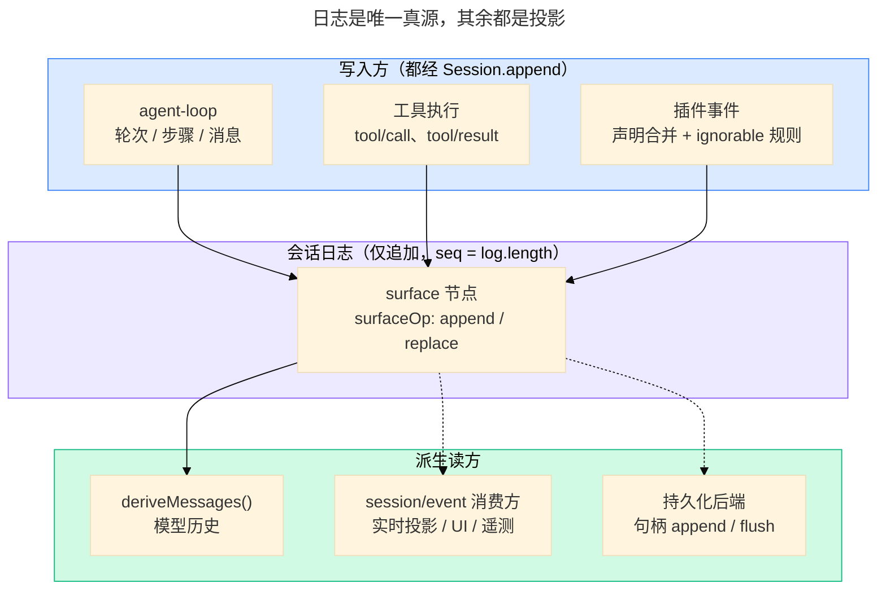

# 会话日志与派生上下文：模型到底看见了什么

> 本文是 `references/dsh/index.md` 的子页；日志怎么落到磁盘、格式版本与迁移见同目录的 `persistence-and-format.md`。
>
> **范围**：一次交互在 `SessionEvent` 日志里留下什么、这份日志怎么变成模型可见的 `Message[]`、插件新增事件类型时必须遵守什么。
> 轮次与步骤的时序主干见 `references/dsh/architecture.md` §6；事件域与扩展点判据见 `references/dsh/extension-points.md`；
> 为什么这样设计见 `references/dsh/design-principles.md` §1。
> **事实 pin**：`deepseek-harness@dsh-v0.2.0-rc.2`。本页写机制与契约，不堆随版本变化的清单。
> 上游权威：`docs/subsystems/session.zh.md`（规范全文）、`packages/core/session/README.zh.md`（包契约）、
> `docs/agent-lifecycle.zh.md`（轮次 / 步骤时序）、`docs/persistence-catalog.zh.md`（事件词汇生成目录）。

## 1. 唯一真源

`Session` 是一份**仅追加**的 `SessionEvent` 日志（`packages/core/session`），它是 agent 完整交互历史的唯一真源。
LLM 消息历史**从日志派生**，从不单独存储：

- **模型可见 ⟺ 已记录**：任何进入模型请求的东西都必须能从日志重建。要给模型新的可见输入，就得**新增会话事件**，
  不能只在内存里塞（这条不变式见 `references/dsh/design-principles.md` §1）。
- **派生面读同一份已提交事件**：`deriveMessages()`（模型历史）、surface（当前与已遮蔽节点）、transcript、
  `session/event` 的实时消费方，都是同一日志的不同投影。
- **实时事件不持久**：`agent/*`、`llm/stream`、`agent/assistant-stream` 是进程本地协调面；持久化与回放只认
  `session/event`（见 `references/dsh/architecture.md` §6）。



## 2. 事件词汇

`SessionEventMap` 是可合并扩展的事件表，核心成员按用途分四组：

| 组       | 成员                                                                                      | 作用                                                                   |
| -------- | ----------------------------------------------------------------------------------------- | ---------------------------------------------------------------------- |
| 执行封闭 | `turn/start`、`turn/end`、`step/start`、`step/end`                                        | 轮次与步骤边界；`turn/end` 带 `TurnEndReason`                          |
| surface  | `system/message`、`developer/message`、`user/message`、`assistant/message`、`tool/result` | 产生模型的可见消息（见 §4）                                            |
| 工具     | `tool/call`（模型原始调用意图）、`tool/result`（结果与失败身份）                          | 调用与结果按 `callId` 配对                                             |
| 仅日志   | `assistant/attempt`、`request/header`、`request/context`、`session/end-seed`              | 不产生消息：保留未成消息的模型 attempt、请求信封、路由元数据、种子边界 |

- **全量清单路由到生成目录**：`docs/persistence-catalog.zh.md` 由 `scripts/gen-persistence-catalog.ts` 生成，
  列出全部成员（含插件贡献）、payload、surface 标记与声明位置。本页不复制它。
- **`TurnEndReasonMap`** 同样是可合并扩展的和类型；`interrupted`（崩溃后补齐）与 `forked`（fork 边界）是唯一两个
  loop 不会实时发出的原因，见同目录的 `persistence-and-format.md` §4。
- **事件载荷必须无损 JSON**：`Session.append` 在写入点逐值校验（BigInt、函数、symbol、`undefined`、`-0`、非有限数、
  循环引用、稀疏数组、Map/Set/Date 等一律拒绝），坏的载荷在 append 处失败，永远不会落进日志。

## 3. 事件信封与两个序号

每条日志条目是 `{ type, seq, time, data, ignorable? }`，并按键类型条件携带 surface 元数据：

- **`seq === log.length`**：序号从 0 连续，没有空洞；恢复或导入的 seed 也必须从 0 连续，否则拒绝。
- **两个序号 brand 不可混用**：`SessionSeq` 是「已存在的事件位置 / 闭区间端点」，`SessionLogOffset` 是
  「缺口、前缀长度、读取偏移」，后者可以等于事件总数。
- **`ignorable?: true` 的默认方向是「必需」**：读方遇到不认识的 `type` 而没有这个标记时**必须拒绝重建整份日志**，
  而不是静默跳过——未知的必需事件可能改变其余日志的解释方式。它只标在丢失不影响重建的纯信息记录上，
  且 `Session.append` 无法设置它（只有 seed / 恢复 / 传输入参能带）。
- **`time` 是 epoch 毫秒**；事件值在入日志前被深冻结，`append` 返回的是入日志的快照，而不是调用方仍在改的对象。

## 4. surface：消息怎么进入派生历史

`SurfaceEventType` 恰好是 §2 表里的五个 surface 成员。它们必须声明如何加入有序 surface：

- **`surfaceOp: 'append'`**：常规尾部追加（user / assistant / tool 消息）。
- **`surfaceOp: { op: 'replace', startSeq, endSeq }`**：用本事件替换 surface 上某个**闭区间**的现有节点
  （区间端点必须是当前 surface 节点，`startSeq === endSeq` 表示替换一个节点）。compaction 用它把被概括的历史遮蔽掉。
- **`sourceEventSeqs`**：声明被替换覆盖的完整来源集合——非空、无重复、严格早于本事件、且必须覆盖全部被遮蔽节点；
  `assistant/message` 禁止携带（它的内嵌 stream 就是精确证据）。
- **非 surface 事件禁止携带这两个字段**（编译期即拒绝），运行期 `surfaceOpOf` 再次校验。
- **替换有额外保护**：`tool/result` 的替换只能改消息内容；系统提示词占据的 surface 0 号节点只能被「恰好替换该一个
  节点」的 `system/message` 覆盖，更靠后的 system 节点是普通历史。

`Session.surface` 暴露只读视图 `{ nodes, replaceGeneration, contentGeneration }`：`replaceGeneration` 只数替换，
`contentGeneration` 还把插件消息投影算进去（§6），两者是增量读方区分「纯尾部增长」与「重写」的依据。

## 5. `deriveMessages()`：投影规则与缓存

`Session.deriveMessages()` 走 surface 上的消息产生事件，`deriveEventMessage(event)` 是逐节点的纯投影函数：

- `user/message` → 原样承载其 `content` 的 user 消息。
- `system/message` / `developer/message` / `assistant/message` → 其 `message`；**内容为空时不产出消息**
  （截断但仍保留 stream 与 usage 的步骤因此不会污染提供方 transcript）。
- `tool/result` → 一等 tool-role 消息（结果内容 + 工具调用标识）。
- 其余一律不产出（`turn/*`、`step/*`、`assistant/attempt`、插件仅日志事件）。

**缓存语义**：纯尾部增长只需折叠新节点；发生替换或消息投影（`contentGeneration` 变化）时重建。每次调用返回
**新的数组**（之后 append 不会增长调用方已持有的数组），但数组里的 `Message` 对象**共享且深冻结**——通过投影改
已记录的历史在类型上不可表达。独立读方用 `foldSurface(events, projections)` 的 `projectedMessages` 配
`deriveEventMessage()`，得到与缓存完全相同的规则。

## 6. 插件新增事件：两种合并扩展点

**a) 新增事件类型**（声明合并，~25 个内置包在用）：

```ts
declare module '@deepseek-ai/dsh-session/types' {
  interface SessionEventMap {
    'my/event': { turn: number; step: number; payload: string };
  }
}
```

只写 payload；信封字段（`seq` / `time` / `ignorable`）由核心填。同一 specifier 也可合并 `TurnEndReasonMap`
新增轮次结束原因。新增事件默认 **required-on-read**（§3）：老构建读到它必须拒绝整份日志。

**b) 修改既有消息内容**（消息投影）：

- 在声明上标 JSDoc `@messageProjection`（生成器据此产出 `MESSAGE_PROJECTION_EVENT_TYPES`），并用
  `ctx.sessions.registerMessageProjection()` 注册纯处理器；处理器接收决策前的完整历史，校验通过后返回
  「按原始 seq 键控的不可变消息副本」。
- 缺少处理器时，append、恢复、独立折叠全部拒绝；**卸载已使用过的处理器后，读取缓存也拒绝**——带
  `@messageProjection` 的事件类型不能靠卸载插件来「变可选」。当前唯一的第一方例子是图片省略 `image/offload`。
- **归属不可转让**：同一事件类型不能被两个插件同时注册；注册是调用 fiber 上的 effect，disposer 一挂，键就消失。

## 7. fork、恢复与所有权边界

- **`ctx.sessions` 是活会话注册表**：`create()`（自带 fiber 生命周期）、`get()`、`list()`、`fork()`。
- **`fork(source, boundary?)`**：`boundary` 是按 seq 的**闭区间**前缀，默认取最后一个事件；所选前缀不得停在开放轮次内
  （否则拒绝，不静默截断）。子会话复制该前缀、继承 `cwd`、记 `parentSession` 与 `isSeeded`，
  `inheritedEventCount` 只数被复制的事件（不含合成的收尾事件）。
- **`session/end-seed` 只有构造函数与 `buildForkSeed` 能写**：它把「继承来的历史」与「本生命周期的新工作」分开；
  插件写它会把此前的所有开闭括号静默划成种子历史，因此禁止。
- **两条构造路径的所有权不同**：`Session.create()` 复制并深冻结借用来的 seed；`Session.fromRestore()` 直接采纳
  独立拥有或已深冻结的 seed（不复制、不再校验载荷形状以外的东西）。恢复路径还需要 `inheritedEventCount`。
- **删除与清洗不在这里**：会话没有删除 API；持久化侧细节见同目录的 `persistence-and-format.md`。

## 8. 失败面：写错时的可观察表现

| 写错的写法                                   | 表现                                                                 |
| -------------------------------------------- | -------------------------------------------------------------------- |
| 事件载荷含不可序列化值                       | `append` 当场抛错；日志不变                                          |
| surface 事件漏 `surfaceOp` / 非 surface 带它 | 编译期拒绝；运行期 `surfaceOpOf` 抛错                                |
| 替换区间端点不在当前 surface 上              | 拒绝该替换（不静默退化为追加）                                       |
| 新增事件被老构建读到                         | 老构建**拒绝重建整份日志**而不是跳过（除非信封标 `ignorable: true`） |
| 用了 `@messageProjection` 但没注册处理器     | append / 恢复 / 折叠全部拒绝                                         |
| 注册了处理器后又卸载插件                     | 后续读取该会话拒绝（缓存也不例外）                                   |
| seed / 导入事件的 `seq` 不连续               | `create` / `fromRestore` 抛错                                        |

## 9. 源码最后手段

本页与上游 README 覆盖不到的细节才读源码：

- 只看一条事实：`git -C 3rdp/deepseek-harness show deepseek-harness@dsh-v0.2.0-rc.2:<path>`（只读，不切换工作树）。
- 本页引用的每条上游路径都在 `src/facts.test.ts` 有台账条目；失效时测试按条目报出来。
